## 👋 Hi, I'm lemon

- Backend engineer, learner
- Java / Python
- 📚 Reading · 🎮 Gaming · 📷 Photography · ✈️ Travel

## 🖥️ Recently Activity

<!--RECENT_ACTIVITY:start-->
1. ⬆️ Pushed to [lengmodkx/lengmodkx](https://github.com/lengmodkx/lengmodkx) 
2. 🔱 Forked [lengmodkx/photo-relic-editorial](https://github.com/lengmodkx/photo-relic-editorial) from [wnby/photo-relic-editorial](https://github.com/wnby/photo-relic-editorial) 
3. ❗ Opened issue [#1](https://github.com/wnby/photo-relic-editorial/issues/1) in [wnby/photo-relic-editorial](https://github.com/wnby/photo-relic-editorial) 
4. 💬 Commented on [#1595](https://github.com/ccusage/ccusage/issues/1595#issuecomment-5262383387) in [ccusage/ccusage](https://github.com/ccusage/ccusage) 
5. ⬆️ Pushed to [lengmodkx/lengmodkx](https://github.com/lengmodkx/lengmodkx) 
6. ⬆️ Pushed to [lengmodkx/lengmodkx](https://github.com/lengmodkx/lengmodkx) 
7. ⬆️ Pushed to [lengmodkx/lengmodkx](https://github.com/lengmodkx/lengmodkx) 
8. ⬆️ Pushed to [lengmodkx/omr-service-streamlit](https://github.com/lengmodkx/omr-service-streamlit) 
9. 💪 Opened PR [#11](https://github.com/lengmodkx/omr-service-streamlit/pull/11) in [lengmodkx/omr-service-streamlit](https://github.com/lengmodkx/omr-service-streamlit) 
10. ⬆️ Pushed to [lengmodkx/lemonBlog](https://github.com/lengmodkx/lemonBlog) 
<!--RECENT_ACTIVITY:end-->

## 📊 GitHub Stats

GitHub 贡献数据 → FIFA 球员卡风格,由 [gitfut.com](https://github.com/Younesfdj/gitfut) 生成。