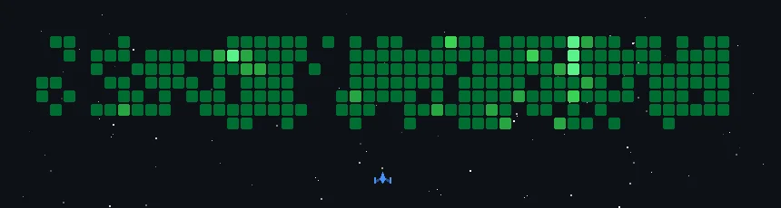

## 👋 Hi, I'm lemon

- Backend engineer, learner
- Java / Python
- 📚 Reading · 🎮 Gaming · 📷 Photography · ✈️ Travel

## 🖥️ Recently Activity

<!--RECENT_ACTIVITY:start-->
1. ❗ Opened issue [#1](https://github.com/wnby/photo-relic-editorial/issues/1) in [wnby/photo-relic-editorial](https://github.com/wnby/photo-relic-editorial) 
2. 💬 Commented on [#1595](https://github.com/ccusage/ccusage/issues/1595#issuecomment-5262383387) in [ccusage/ccusage](https://github.com/ccusage/ccusage) 
3. 💪 Opened PR [#11](https://github.com/lengmodkx/omr-service-streamlit/pull/11) in [lengmodkx/omr-service-streamlit](https://github.com/lengmodkx/omr-service-streamlit) 
<!--RECENT_ACTIVITY:end-->

## 🎮 Space Shooter Game

> 把我的 GitHub 贡献图变成 Galaga 风格的小游戏 —— 贡献越多敌人越强，每天 00:15 UTC 自动刷新。
> 由 [czl9707/gh-space-shooter](https://github.com/czl9707/gh-space-shooter) 驱动。

## 📊 GitHub Stats

GitHub 贡献数据 → FIFA 球员卡风格,由 [gitfut.com](https://github.com/Younesfdj/gitfut) 生成。